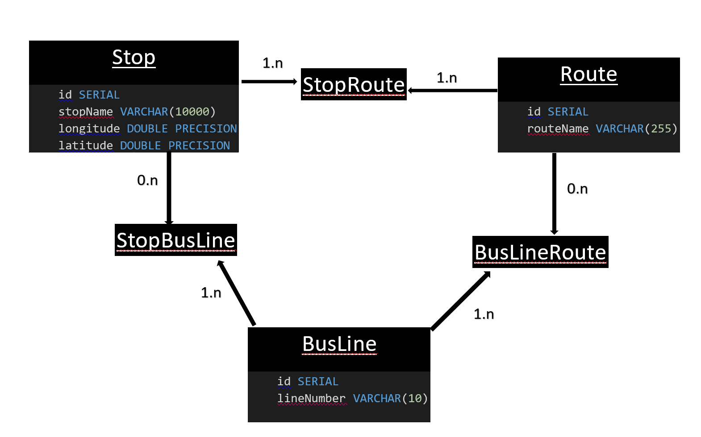

# BusApp

## Video Link
- [click-here](https://drive.google.com/file/d/1NGAfmpIdEdD1Z0beMQebwyXSZYQ_edL0/view?usp=drive_link)

## Swagger Link
- [click_here_swagger_link](https://petstore.swagger.io/?url=https://raw.githubusercontent.com/Ngitangita/BusApp/main/src/main/java/hei/school/busapp/BusApp.yaml)

## Note
    - A bus route or a bus can have at least two stops: the starting point and the destination.

## Modelisation de la base de donnee (MCD)

